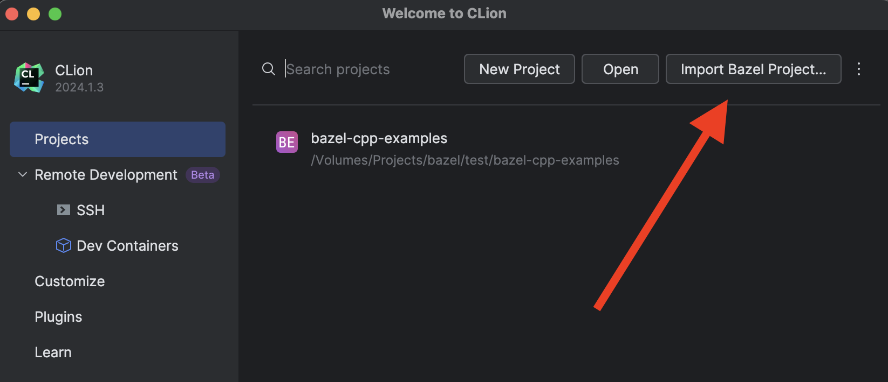
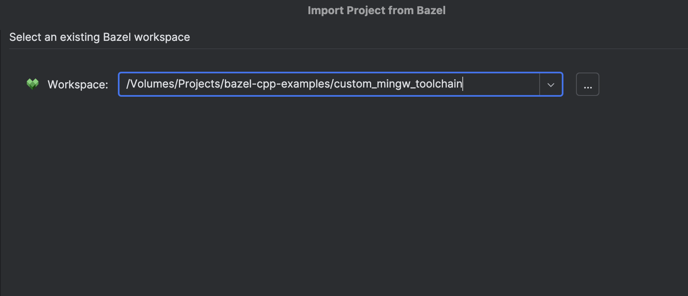
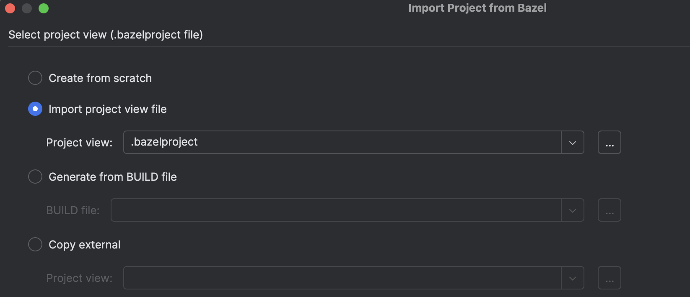

## CPP Custom Toolchain Examples

Collection of multiple custom toolchain examples which work well with the [Bazel Plugin for CLion](https://plugins.jetbrains.com/plugin/9554-bazel-for-clion). You can find more information abut each toolchain in their `README.md`.

### How to open a project in CLion?

1. Open the "Import Bazel Project" dialog from the welcome screen or under "File | Import Bazel Project":
   
2. Select the workspace which you want to import:
   
3. Select the project view file in the root of the workspace:
   
